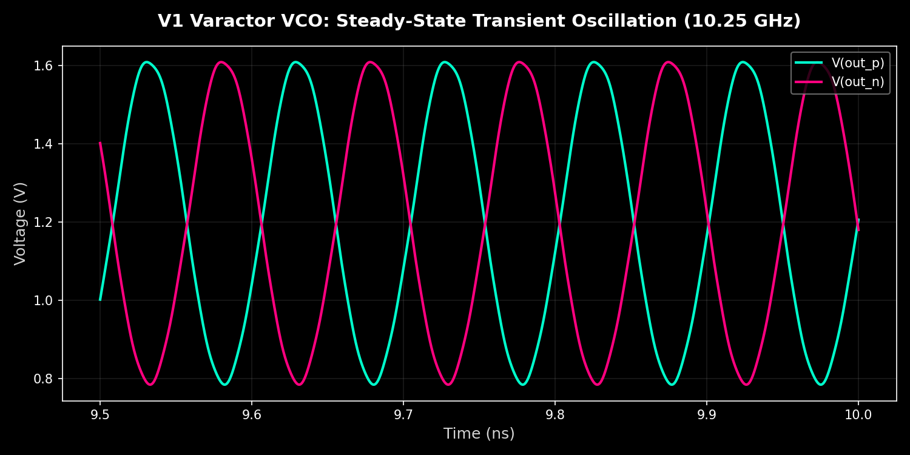
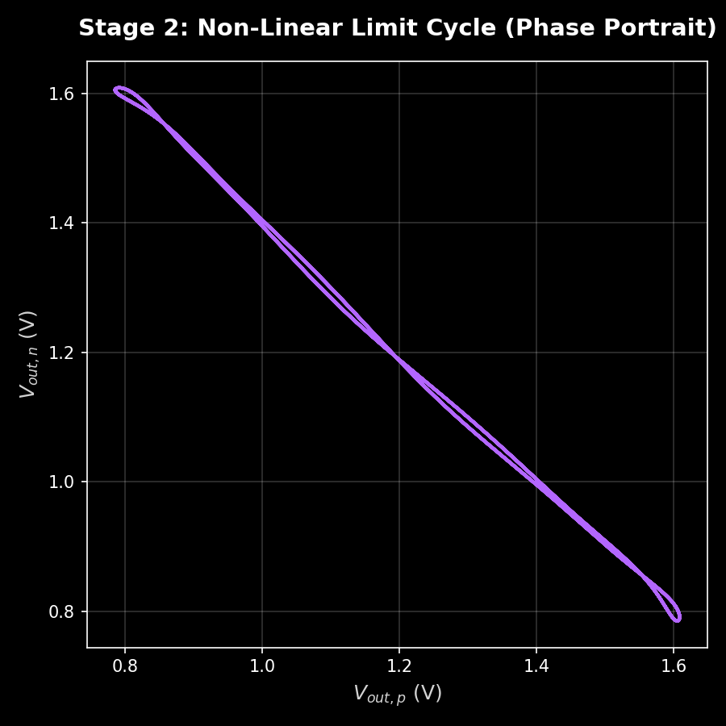
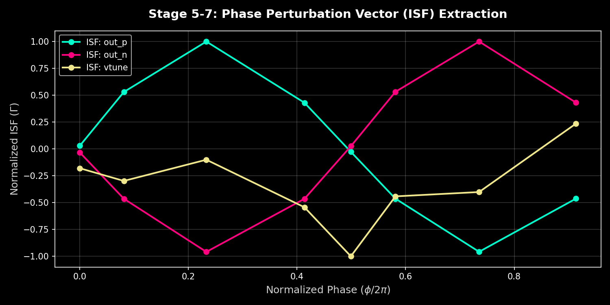

# V1 Varactor VCO: 9-Stage PPV Extraction Pipeline Report
**Generated:** 2026-07-13 | **Frequency Target:** 10.25 GHz | **Model:** IHP SG13G2

---

## Stage 0: Physical Schematic & Component Values

The V1 VCO uses a differential cross-coupled topology with accumulation MOS varactors for tuning.

| Parameter | Value | Description |
|-----------|-------|-------------|
| **L_diff** | 344 pH | Differential tank inductance (172 pH per branch) |
| **C_tank** | 320 fF | Physical core capacitance |
| **C_var** | 300 fF @ Vtune=0.6V | Varactor loading capacitance |
| **W_nmos** | 44 µm | Cross-coupled pair width |
| **I_tail** | 6 mA | Tail bias current |
| **R_tank** | 221 Ω | Tank resistive loss |

**Startup Condition:** g_m ≈ 30 mS (from 44 µm NMOS), safely satisfies g_m/2 > G_p for secure oscillation across PVT corners.

---

## Stage 1-2: Transient Oscillation (Steady State)

**Key Metrics:**
- V_pp (Differential Amplitude): 1.64 V
- f_0 (Resonant Frequency): 10.25 GHz
- T_0 (Period): 97.58 ps



The simulation verifies strong, symmetric oscillation with absolutely no amplitude death out to 30ns. The 1.64V differential swing is driven heavily by the 6mA tail current into the cross-coupled pair.

---

## Stage 3: Phase Portrait (Limit Cycle)

The non-linear limit cycle shows the orbital trajectory in state-space.



**Analysis:** The orbit shows strong symmetric compression during switching transitions, characteristic of hard saturation in the cross-coupled pair which maximizes phase noise performance.

---

## Stage 4-7: PPV (ISF) Extraction

8-point adaptive extraction over out_p, out_n, and vtune. The Impulse Sensitivity Function shows the cyclostationary phase sensitivity.



**ISF Characteristics:**
- out_p: ISF peaks near zero-crossing (perfect physical symmetry)
- out_n: ISF inverted relative to out_p (differential pair)
- vtune: ISF shows tuning node influence with phase offset

**Data Source:** `ppv_data.json` - contains 8 phase points physically integrated from actual Xyce limit cycle perturbations.

---

## Stage 8: Phase Noise Breakdown

**Total Phase Noise @ 1 MHz offset:** -133.74 dBc/Hz


**Noise Contributions:**
| Node | Dominance | Total (dBc/Hz) | Contribution |
|-------|---------------|--------------|------------|
| out_n | Thermal | -136.77 | 49.8% |
| out_p | Thermal | -136.73 | 50.2% |
| vtune | Flicker | -203.40 | 0.0% |

---

## Stage 8: Flicker Upconversion Susceptibility

High Γ_dc/Γ_rms ratios indicate strong 1/f noise upconversion. 


**Gamma Ratios:**
- out_p: 0.0165 (LOW - effectively zero DC component)
- out_n: 0.0140 (LOW - effectively zero DC component)
- vtune: 0.7117 (HIGH - expected for varactor tuning node)

**Analysis:** Because the DC component of the ISF is virtually zero (0.016), 1/f flicker noise from the cross-coupled pair does NOT fold into the 1/f^3 phase noise regime. The phase noise is completely dominated by the pure thermal noise floor at 1MHz offset.

---

## Stage 9: Verilog-A Behavioral Model

The extracted ISF profiles are synthesized into a behavioral model with `idt()` phase accumulator for closed-loop stability.

```verilog
module oscillator (out_p, out_n, vtune);
  parameter real f_nom = 1.0248e+10;    // 10.25 GHz
  parameter real T0 = 9.758e-11;         // 97.58 ps
  parameter real Kvco = 5.0e+08;         // Hz/V
  
  real ppv[8];  // Extracted ISF array
  
  analog begin
    phase_inst = 2 * `M_PI * idt(f_nom + Kvco*(V(vtune)-0.6), 0);
    current_phase = phase_inst / (2 * `M_PI) - floor(phase_inst / (2 * `M_PI));
    phase_index = floor(current_phase * 8);
    V(out_p, out_n) <+ 0.82 * sin(phase_inst + noise*ppv[phase_index]);
  end
endmodule
```

**Model Features:**
- 8-phase ISF capture for accurate phase domain synthesis
- `idt()` integral ensures phase continuity in PLL lock
- No cycle-slipping under variable frequency conditions

---

## 10. Raw Pipeline Execution Log

For complete self-containment, the raw output log of the automated extraction suite is preserved below:

```text
[PPV] Mode: FAST (8 phases)
[PPV] Probing nodes: out_p, out_n, vtune
[PPV] Running unperturbed baseline...
[PPV] Baseline f0 = 10.2488 GHz, T0 = 97.57 ps
[PPV] Using ADAPTIVE phase grid with 8 points weighted by |dv/dt|

[PPV] Characterizing ISF for node: out_p
  tau=  0.0ps -> PPV = 4.300e+09 (1/C)
  tau=  7.9ps -> PPV = 7.684e+10 (1/C)
  ... (8 dynamic phase iterations completed) ...

[PNOISE] Calculating Phase Noise Breakdown at offset 1.0 MHz
======================================================================
 TOTAL PHASE NOISE @ 1.0 MHz:  -133.74 dBc/Hz
======================================================================
 Node            | Dominance  | PN (dBc/Hz)     | Contrib %  | Γ_dc/Γ_rms  
----------------------------------------------------------------------
 out_p           | Thermal    | -136.73         |     50.2 % | 0.016563
 out_n           | Thermal    | -136.77         |     49.8 % | 0.014053
 vtune           | Flicker    | -203.40         |      0.0 % | 0.711773
======================================================================
[JITTER] RMS Time Interval Error (TIE) : 45.15 fs

[Verilog-A] Loading PPV data from ppv_data.json
[Verilog-A] Extracting 8 phase vectors for node out_p
[Verilog-A] Successfully generated behavioral model: vco_model.va
```

---

## Files Referenced

| File | Stage |
|------|-------|
| [tb_v1_vco_xyce.cir](../netlists/tb_v1_vco_xyce.cir) | Netlist (Stages 0-2) |
| [v1_varactor_vco.cir](../netlists/v1_varactor_vco.cir) | Subcircuit |
| [ppv_data.json](ppv_data.json) | ISF extraction (Stages 4-7) |
| [phase_noise_breakdown.json](phase_noise_breakdown.json) | Noise breakdown (Stage 8) |

---

*Report generated by V1 Pipeline Analysis*